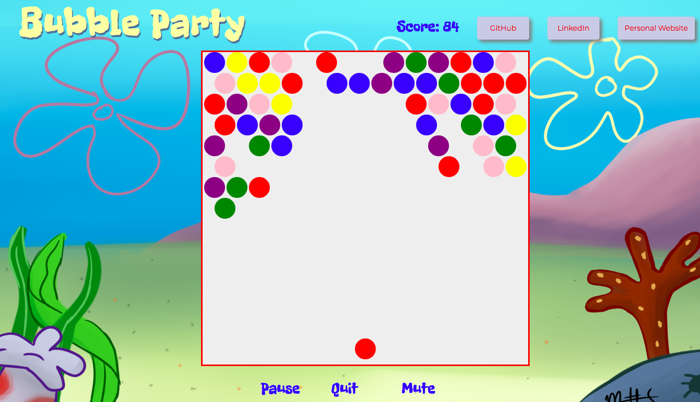
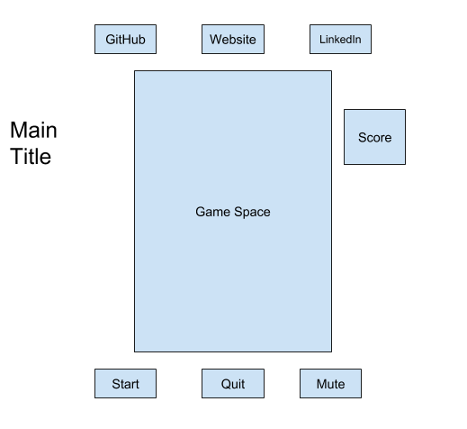

# Bubble-Party

This is a game that engages user to "shoot" bubbles to gain score points. Game starts off with a single player. Bubbles of different color start continuously growing from the top of the game area. Player needs to hit bubbles that are adjacent to 2 or more bubbles of the same color.

I built the game using JavaScript, Canvas, HTML5, CSS3, Firebase, Webpack.

Here are the **MVPs**:
* Start, quit game at any time
* Be able to shoot bubbles
* Have accumulative score system
* Three or more adjacent bubbles of the same color create a cluster and drop if one of them is shot
* Game is over when main mass of bubbles reaches the bottom of the game area
* Option to play sound effects or to mute them
* Have a production ReadMe file

### Wireframes

### Timeline
**Day1:**
* Created a Main Layout design
* Added buttons functionality

**Day2:**
* Created the bubbles growth and color feature
* Added styling

**Day3:** 
* Created player feature
* Created smooth interaction between player and bubbles
* Styled the spec effects

**Day4:**
* Finished styling
* Cleaned up/refactored code

Additional feature for the future development:

### Backend
There will be a Users table with following columns: id, username, score. I will use Firebase to store and update information

